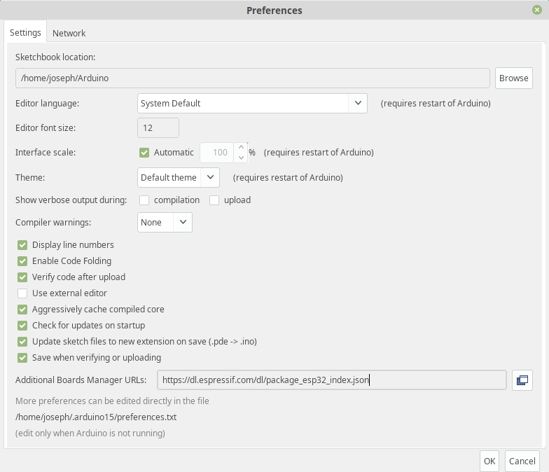
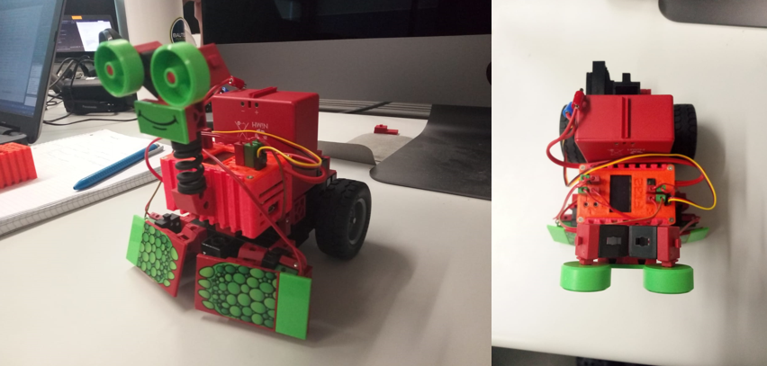
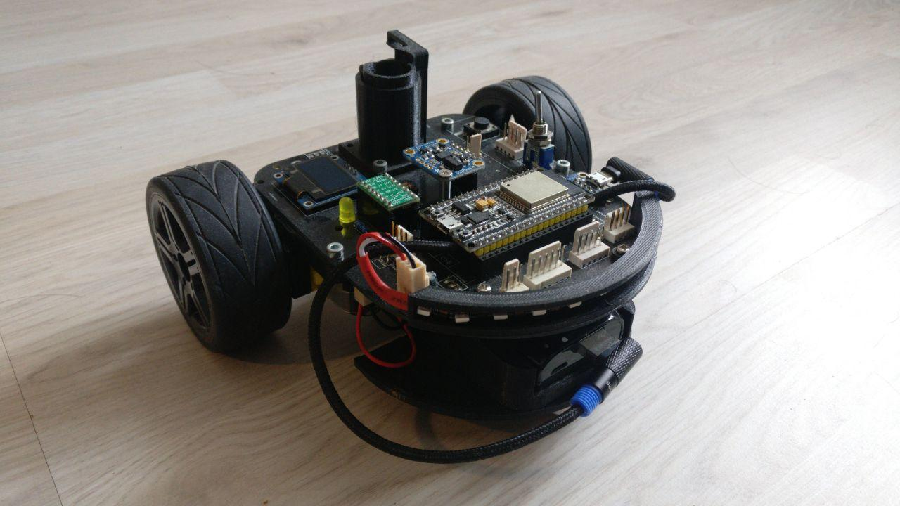

# ft32

<p align="center"></p>

Fischertechnik TXT Controller replacement based on ESP32 micro controller with a fancy web programmable HMI. The broswer IDE is rest upon [cody++](https://github.com/josephpal/cody-pp) version 1.0 (once ESP IDE).

If you want to checkout the current cody++ web IDE version 1.0, please visit the demo [page](http://hit-karlsruhe.de/hit%2Dinfo/FT32/codypp/#/). The latest version is avaiable [here](http://hit-karlsruhe.de/hit%2Dinfo/FT32/codypp/#/).

## Installation

First of all, we have to install several libraries to work with the current hardware setup. After installing the latest Arduino IDE version, we have to add the ESP32 core to our arduino installation. Therefore, an additional board manager URL has to be added. You can now go on with integrating the ESP32 core to arduino. To do so, you have to open your Arduino IDE and navigate to ``File -> Preferences -> Additional Boards Manager URLs` and paste the [link]( https://dl.espressif.com/dl/package_esp32_index.json) given in the picture below into the input field.

<p align="center"></p>

Confirm the window, go to ``Tools -> Board -> Boards Manager...``, search for esp32, and once again confirm the installation and wait until all neccessary files are downloaded and set up. Now we can install the additional libraries to work with our custom hardware ([ft32](http://www.hit-karlsruhe.de/hit-info/info-ss19/FT32-HWK2/0401AusgewaehlteLoesung.html), [eMalRob](http://hit-karlsruhe.de/hit-info/info-ws19/MalRob_Platine/0406Platinenlayout.html)).

<p align="center"></p>

<p align="center"></p>

To get this done, open the menu entry under ``Tools -> Manage Libraries...`` and search for the following libraries and install them one by one:

- Adafruit BNO055 (latest version, tested with 1.1.11)
- Adafruit GFX Library (latest version, tested with 1.3.6)
- Adafruit NeoPixel (latest version, tested with 1.2.4)
- Adafruit SSD1306 (latest version, tested with 1.2.9)
- Adafruit Unified Sensor (latest version, tested with 1.1.2)
- ESP32 AnalogWrite (tested with 0.1.0)
- ESP8266 and ESP32 OLED driver for SSD1306 displays (tested with 4.1.0)
- SX1509 IO Expander (latest version, tested with 2.0.1)

Now you have to flash the ESP32 with the C++ software. Therefore you have to open the ft32.ino file from our github repository , compile the source code and after that you have to flash the micro controller.
After successfully flashing the ESP32 micro controller, you can go on with writing the necessary web files into the flash memory (called ``SPIFFS``) of the ESP32. It might be difficult, but we have created a tutorial to make it as easy as possible.

### Writing files to SPIFFS Memory

Tested under:
- Windows 10 - 64bit OS, Arduino IDE 1.8.7
- Linux Mint 19 - 64bit OS, Arduino IDE 1.8.8

If you want to write the necessary web and configuration files to the internal storage of the ESP32 micro controller, you have to install an [arduino plugin](https://github.com/me-no-dev/arduino-esp32fs-plugin).

First of all you have to download the plugin from its github [documentation page](https://github.com/me-no-dev/arduino-esp32fs-plugin/releases/download/1.0/ESP32FS-1.0.zip). After that, extract the archive to ``` <home_dir>/Arduino/tools/```

In some case you have to create a tools directory in your arduino sketchbook directory (after extracting the downloaded archive, the path the path will look like ``` <home_dir>/Arduino/tools/ESP32FS/tool/esp32fs.jar ```). Furthermore a directory ```/data``` with all necessary Cody++ web files has to be in the current arduino project directory. Now you can restart your arduino ide. A new menu entry should be available under "Tools" (ESP32 Sketch Data Upload).

<p align="center"></p>

Make sure the ESP32 is connected correctly to your computer and no Arduino console is opened anymore. By default, the ESP32 should be connected to port /dev/ttyUSB0. After uploading the spiffs files you can go on with compiling and flashing the source code. For more information, please visit this documentation [page](http://hit-karlsruhe.de/hit-info/info-ws17/Fischertechnik-Software-HMI/0410Bedienungsanleitung.html). That's it. Hope you enjoy our project. If you have questions or ideas, feel free to contact us.

<p align="center"></p>

## Web documentation

For further information to this project visit our official documentation [webpage](http://hit-karlsruhe.de/hit-info/info-ws17/Fischertechnik/).

## Cody++ (with FT32 robots) in use

Video dokumentation (in german): 

<p align="center" >
  <a href="http://www.youtube.com/watch?v=Vb2udfsyRjI" target="_blank" >
    
  </a>
</p>

German pubils testing our Robots: 

<p align="center" >
  <a href="http://www.youtube.com/watch?v=EfkDjtZDj-Y" target="_blank" >
    
  </a>
</p>

<p align="center" >
  <a href="http://www.youtube.com/watch?v=YJIpydJqEwY" target="_blank" >
    
  </a>
</p>