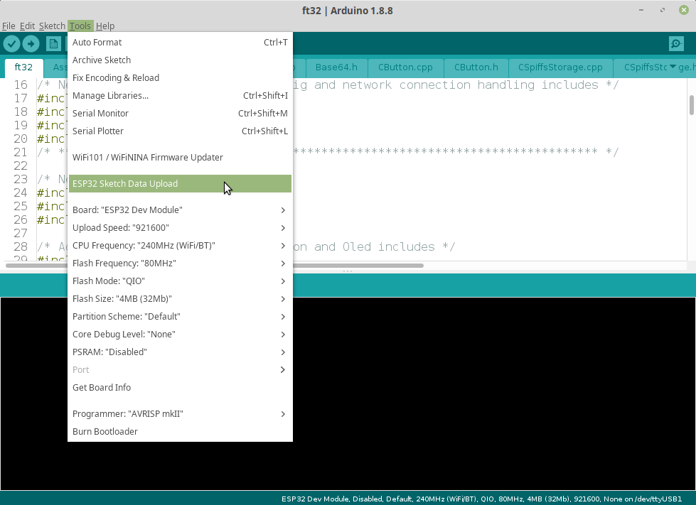
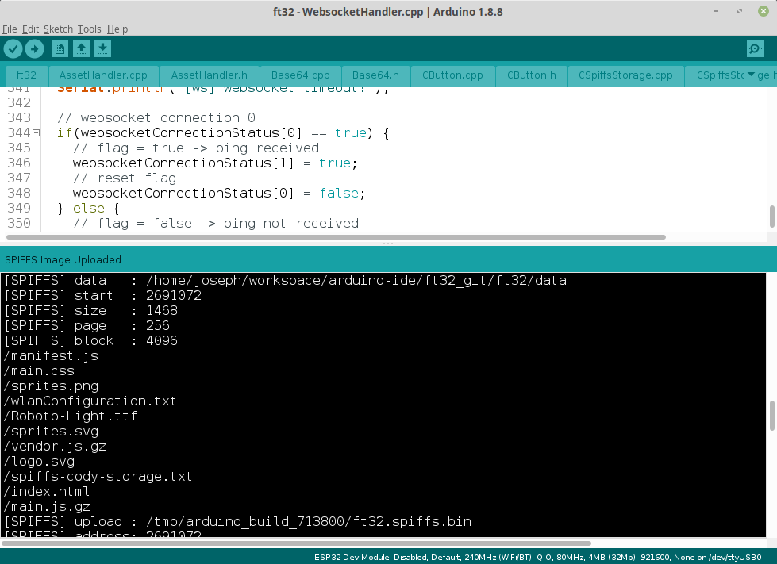

# ft32

<p align="center"></p>

Fischertechnik TXT Controller replacement based on ESP32 micro controller with a fancy web programmable HMI. The broswer IDE is rest upon [cody++](https://github.com/josephpal/cody-pp) version 1.0 (once ESP IDE).

If you want to checkout the current cody++ web IDE version 1.0, please visit the demo [page](http://hit-karlsruhe.de/hit%2Dinfo/FT32/codypp/#/). The latest version is avaiable [here](http://hit-karlsruhe.de/hit%2Dinfo/FT32/codypp/#/).

## Installation

Beside the hardware setup we also have to install several libraries to work with the arduino ide. After that we can go on with preparing the ESP32 so that Codypp will work out of the box from the internal storage.

### Hardware and Arduino IDE setup

Before you can start, you have to install some dependencies und you need additional hardware. Beside the ESP32 micro controller as the main component, you will need:

- [OLED](http://www.dx.com/p/0-96-128x64-i2c-interface-blue-color-oled-display-module-board-for-arduino-419232) Display
- [Motor](https://www.pololu.com/product/2137) driver

Please make sure you have connected all components correctly as it is mentioned on this [documentation page](http://hit-karlsruhe.de/hit-info/info-ws17/Fischertechnik/0404Portbelegungsplan.html).

Now you have to flash the ESP32 with the C++ software. Therefore you have to open the ft32.ino file from our github repository in the Arduino IDE (make sure you have setup up your [Arduino Environment](https://github.com/espressif/arduino-esp32) correctly), compile the source code and after that you have o flash the micro controller.

Make sure you have installed the following arduino libraries via the internal arduino packet manager:

- Adafruit SSD1306 (latest version, tested with 1.2.9)
- Adafruit-GFX-Library (latest version, tested with 1.3.4)
- SparkFun SX1509 (latest version, tested with 2.0.1)

Now you can go on with writing the necessary web files into the flash memory (called SPIFFS) of the ESP32. It might be difficult, but we have created a tutorial to make it as easy as possible.

### Writing files to SPIFFS Memory

Tested under:
- Windows 10 - 64bit OS, Arduino IDE 1.8.7
- Linux Mint 19 - 64bit OS, Arduino IDE 1.8.8

If you want to write the necessary web and configuration files to the internal storage of the ESP32 micro controller, you have to install an [arduino plugin](https://github.com/me-no-dev/arduino-esp32fs-plugin).

First of all you have to download the plugin from its github [documentation page](https://github.com/me-no-dev/arduino-esp32fs-plugin/releases/download/1.0/ESP32FS-1.0.zip). After that, extract the archive to ``` <home_dir>/Arduino/tools/```

In some case you have to create a tools directory in your arduino sketchbook directory (after extracting the downloaded archive, the path the path will look like ``` <home_dir>/Arduino/tools/ESP32FS/tool/esp32fs.jar ```). Furthermore a directory ```/data``` with all necessary Cody++ web files has to be in the current arduino project directory. Now you can restart your arduino ide. A new menu entry should be available under "Tools" (ESP32 Sketch Data Upload).

<p align="center"></p>

Make sure the ESP32 is connected correctly to your computer and no Arduino console is opened anymore. By default, the ESP32 should be connected to port /dev/ttyUSB0. After uploading the spiffs files you can go on with compiling and flashing the source code. For more information, please visit this documentation [page](http://hit-karlsruhe.de/hit-info/info-ws17/Fischertechnik-Software-HMI/0410Bedienungsanleitung.html). That's it. Hope you enjoy our project. If you have questions or ideas, feel free to contact us.

<p align="center"></p>

## Web documentation

For further information to this project visit our official documentation [webpage](http://hit-karlsruhe.de/hit-info/info-ws17/Fischertechnik/).

<p align="center"></p>

## FT32 Robots and Cody++ in use

Video dokumentation (in german):
- [FT32-Codypp Pre-relase Video Dez. 2017](https://youtu.be/Vb2udfsyRjI?list=PLPAfNH8UB9_noRanNCsG2tC-wpglnxcxw)

German pubils testing our Robots:
- [Hector-Seminar-Video](https://www.youtube.com/watch?v=EfkDjtZDj-Y&list=PLPAfNH8UB9_noRanNCsG2tC-wpglnxcxw&index=2)
- [Drawing a flower with Codypp and FT32](https://www.youtube.com/watch?v=YJIpydJqEwY&list=PLPAfNH8UB9_noRanNCsG2tC-wpglnxcxw&index=8)
- [Drawing a clef with Codypp and FT32](https://www.youtube.com/watch?v=8gbNc6OlCrc)
